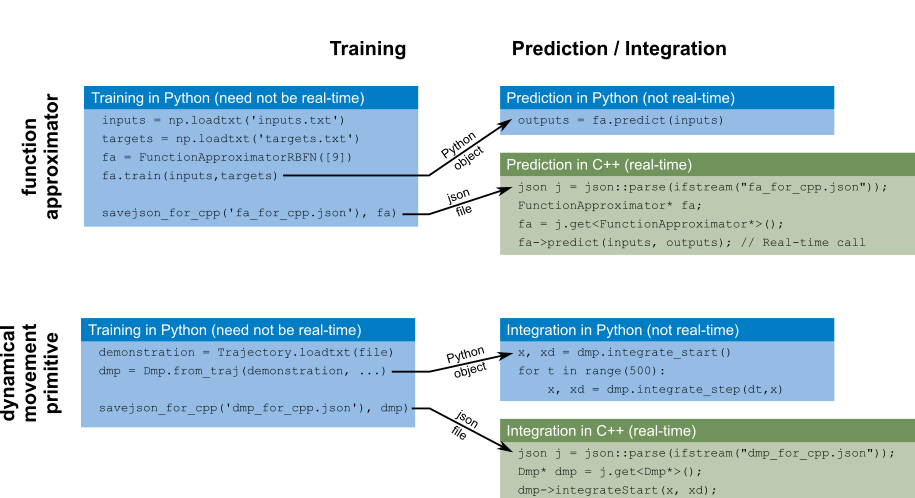

[](https://doi.org/10.21105/joss.01225)

# What?

This repository provides an implementation of dynamical systems, 
function approximators, 
[dynamical movement primitives](http://www-clmc.usc.edu/Resources/Details?id=2663), and black-box optimization
with evolution strategies, in particular the optimization of the parameters
of dynamical movement primitives.

## News: Version 2 

Version 2 of dmpbbo was released in June 2022. If you still require the previous API, or the C++ implementations of training and optimization that used XML as the serialization format, please use v1.0.0: https://github.com/stulp/dmpbbo/tree/v1.0.0


# For whom?

This library may be useful for you if you

+ are interested in the **theory** behind dynamical movement primitives and their optimization. Then the <a href="tutorial/"><b>tutorials</b></a> are the best place to start.

+ already know about dynamical movement primitives and reinforcement learning, but would rather use existing than brew it yourself. In this case, <a href="demos/"><b>demos/</b></a> is a good starting point, as they provide examples of how to use the code.

+ run the optimization of DMPs **on a real robot**. In this case, go right ahead to <a href="demos/robot/"><b>demos/robot/</b></a>. Reading the tutorials and inspecting demos beforehand will help to understand demos/robot.

+ want to develop and contribute. If you want to delve deeper into the functionality of the code, the **doxygen documentation of the API** is for you. See the [INSTALL.md](INSTALL.md) on how to generate it.

## Example code

Here is a quick look at the code functionality for training and real-time execution of dynamical movement primitives (see <a href="demos/python/demo_dmp_training.py">demo_dmp_training.py</a> for the full source code):

```Python
# Train a DMP with a trajectory
traj = Trajectory.loadtxt("trajectory.txt")
function_apps = [ FunctionApproximatorRBFN(10, 0.7) for _ in range(traj.dim) ]
dmp = Dmp.from_traj(traj, function_apps, dmp_type="KULVICIUS_2012_JOINING")

# Numerical integration
dt = 0.001
n_time_steps = int(1.3 * traj.duration / dt)
x, xd = dmp.integrate_start()
for tt in range(1, n_time_steps):
    x, xd = dmp.integrate_step(dt, x)
    # Convert complete DMP state to end-eff state
    y, yd, ydd = dmp.states_as_pos_vel_acc(x, xd)

# Save the DMP to a json file that can be read in C++
json_for_cpp.savejson_for_cpp("dmp_for_cpp.json", dmp)
```

The json file saved above can be read into C++ and be integrated in real-time as follows (see <a href="demos/cpp/demoDmp.cpp">`demoDmp.cpp`</a> for the full source code including memory allocation)

```C++
ifstream file("dmp_for_cpp.json");
Dmp* dmp = json::parse(file).get<Dmp*>();

// Allocate memory for x/xd/y/yd/ydd
dmp->integrateStart(x, xd);
double dt = 0.001;
for (double t = 0.0; t < 2.0; t+=dt) {
    dmp->integrateStep(dt, x, x, xd);
    // Convert complete DMP state to end-eff state
    dmp->stateAsPosVelAcc(x, xd, y, yd, ydd);
}
```


# Why?

For our own use, the aims of coding this were the following:

+ Allowing easy and modular exchange of different dynamical systems within 
  dynamical movement primitives.

+ Allowing easy and modular exchange of different function approximators within 
  dynamical movement primitives.
    
+ Being able to compare different exploration strategies (e.g. covariance matrix 
  adaptation vs. exploration decay) when optimizing dynamical movement primitives.
    
+ Enabling the optimization of different parameter subsets of function approximators.
    
+ Running dynamical movement primitives in the control loop on real robots.


# How?

How to install the libraries/binaries/documentation is described in [INSTALL.md](INSTALL.md)

# Code structure

The core functionality is in the Python package <a href="dmpbbo/">dmpbbo/</a>. It contains five subpackages:

+ <a href="dmpbbo/functionapproximators">dmpbbo/functionapproximators</a> : defines a generic interface for function approximators, as well as several specific implementations (weighted least-squares regression (WLS), radial basis function networks (RBFN), and locally-weighted regression (LWR).
    
+ <a href="dmpbbo/dynamicalsystems">dmpbbo/dynamicalsystems</a> : definition of a generic interface for dynamical 
  systems, as well as several specific implementations (exponential system, sigmoid system, 
  spring-damper system, etc.)

+ <a href="dmpbbo/dmps">dmpbbo/dmp</a> : implementation of dynamical movement primitives, building on the functionapproximator and dynamicalsystems packages.

+ <a href="dmpbbo/bbo">dmpbbo/bbo</a> : implementation of several evolutionary algorithms for the stochastic optimization of black-box cost functions

+ <a href="dmpbbo/bbo_of_dmps">dmpbbo/bbo_of_dmps</a> : examples and helper functions for applying black-box optimization to the optimization of DMP parameters.

The function approximators are trained with input and target data, and a DMP is trained with a demonstrated trajectory. These trained model can be saved to the json format, and then be read by the C++ code in  <a href="src/">src/</a> (with <a href="https://github.com/nlohmann/json">nlohmann::json</a>). The DMP integration functions that are called inside the control loop are all real-time, in the sense that they do not dynamically allocate memory, and not computationally intensive (mainly the multiplication of small matrices). The design pattern behind dmpbbo is thus "Train in Python. Execute in C++.", as illustrated in the image below.

As the optimization algorithm responsible for generating exploratory samples and updating the DMP parameters need not be real-time, requires intermediate visualization for monitoring purposes, and is more easily implemented in a script, the `bbo` and `bbo_of_dmps` subpackages have not been implemented in C++.

To see a concrete example of how the Python and C++ implementations are intended to work together, please see <a href="demos/robot/">`demos/robot/`</a>. Here, the optimization is done in Python, but a simulated "robot" executes the DMPs in C++.




##  Research background

In 2014, I decided to write one library that integrates the different research threads on the acquisition and optimization that I had been pursuing since 2009. These threads are listed below. Also, I wanted to provide a tutorial on dynamical movement primitives for students, along with code to try DMPs out in practice.

* Representation and training of parameterized skills, i.e. motion primitives that adapt their trajectory to task parameters [[matsubara11learning]](#matsubara11learning), [[silva12learning]](#silva12learning),  [[stulp13learning]](#stulp13learning).

* Representing and optimizing gain schedules and force profiles as part of a DMP [[buchli11learning]](#buchli11learning), [[kalakrishnan11learning]](#kalakrishnan11learning)


*  Showing that evolution strategies outperform reinforcement learning algorithms when optimizing the parameters of a DMP [[stulp13robot]](#stulp13robot), [[stulp12policy_hal]](#stulp12policy_hal)

* Demonstrating the advantages of using covariance matrix adaptation for the policy improvement [[stulp12path],[@stulp12adaptive],[@stulp14simultaneous]](#stulp12path],[@stulp12adaptive],[@stulp14simultaneous)

* Using the same unified model for the model parameters of different function approximators [[stulp15many]](#stulp15many). In fact, coding this library lead to this article, rather than vice versa.

If you use this library in the context of experiments for a scientific paper, we would appreciate if you could cite this library in the paper as follows:

    @article{stulp2019dmpbbo,
	author  = {Freek Stulp and Gennaro Raiola},
	title   = {DmpBbo: A versatile Python/C++ library for Function Approximation, Dynamical Movement Primitives, and Black-Box Optimization},
	journal = {Journal of Open Source Software}
	year    = {2019},
	doi     = {10.21105/joss.01225},
	url     = {https://www.theoj.org/joss-papers/joss.01225/10.21105.joss.01225.pdf}
    }

## Bibliography

* <a id="buchli11learning"></a><b>[buchli11learning]</b>  Jonas Buchli, Freek Stulp, Evangelos Theodorou, and Stefan Schaal. <a href="http://ijr.sagepub.com/content/early/2011/03/31/0278364911402527">Learning variable impedance control</a>. <em>International Journal of Robotics Research</em>, 30(7):820-833, 2011.
* <a id="ijspeert02movement"></a><b>[ijspeert02movement]</b>  A. J. Ijspeert, J. Nakanishi, and S. Schaal. Movement imitation with nonlinear dynamical systems in humanoid robots. In <em>Proceedings of the IEEE International Conference on Robotics and Automation (ICRA)</em>, 2002.
* <a id="ijspeert13dynamical"></a><b>[ijspeert13dynamical]</b>  A. Ijspeert, J. Nakanishi, P Pastor, H. Hoffmann, and S. Schaal. Dynamical Movement Primitives: Learning attractor models for motor behaviors. <em>Neural Computation</em>, 25(2):328-373, 2013.
* <a id="kalakrishnan11learning"></a><b>[kalakrishnan11learning]</b>  M. Kalakrishnan, L. Righetti, P. Pastor, and S. Schaal. <a href="http://www-clmc.usc.edu/publications/K/kalakrishnan-IROS2011">Learning force control policies for compliant manipulation</a>. In <em>IEEE/RSJ International Conference on Intelligent Robots and Systems (IROS 2011)</em>, 2011.
* <a id="kulvicius12joining"></a><b>[kulvicius12joining]</b>  Tomas Kulvicius, KeJun Ning, Minija Tamosiunaite, and Florentin Wörgötter. Joining movement sequences: Modified dynamic movement primitives for robotics applications exemplified on handwriting. <em>IEEE Transactions on Robotics</em>, 28(1):145-157, 2012.
* <a id="matsubara11learning"></a><b>[matsubara11learning]</b>  T Matsubara, S Hyon, and J Morimoto. Learning parametric dynamic movement primitives from multiple demonstrations. <em>Neural Networks</em>, 24(5):493-500, 2011.
* <a id="silva12learning"></a><b>[silva12learning]</b>  Bruno da Silva, George Konidaris, and Andrew G. Barto. Learning parameterized skills. In John Langford and Joelle Pineau, editors, <em>Proceedings of the 29th International Conference on Machine Learning (ICML-12)</em>, ICML '12, pages 1679-1686, New York, NY, USA, July 2012. Omnipress.
* <a id="stulp12adaptive"></a><b>[stulp12adaptive]</b>  Freek Stulp. Adaptive exploration for continual reinforcement learning. In <em>International Conference on Intelligent Robots and Systems (IROS)</em>, pages 1631-1636, 2012.
* <a id="stulp12path"></a><b>[stulp12path]</b>  Freek Stulp and Olivier Sigaud. Path integral policy improvement with covariance matrix adaptation. In <em>Proceedings of the 29th International Conference on Machine Learning (ICML)</em>, 2012.
* <a id="stulp12policy_hal"></a><b>[stulp12policy_hal]</b>  Freek Stulp and Olivier Sigaud. <a href="http://hal.archives-ouvertes.fr/hal-00738463">Policy improvement methods: Between black-box optimization and episodic reinforcement learning</a>. hal-00738463, 2012.
* <a id="stulp13learning"></a><b>[stulp13learning]</b>  Freek Stulp, Gennaro Raiola, Antoine Hoarau, Serena Ivaldi, and Olivier Sigaud. Learning compact parameterized skills with a single regression. In <em>IEEE-RAS International Conference on Humanoid Robots</em>, 2013.
* <a id="stulp13robot"></a><b>[stulp13robot]</b>  Freek Stulp and Olivier Sigaud. Robot skill learning: From reinforcement learning to evolution strategies. <em>Paladyn. Journal of Behavioral Robotics</em>, 4(1):49-61, September 2013.
* <a id="stulp14simultaneous"></a><b>[stulp14simultaneous]</b>  Freek Stulp, Laura Herlant, Antoine Hoarau, and Gennaro Raiola. Simultaneous on-line discovery and improvement of robotic skill options. In <em>International Conference on Intelligent Robots and Systems (IROS)</em>, 2014.
* <a id="stulp15many"></a><b>[stulp15many]</b>  Freek Stulp and Olivier Sigaud. <a href="http://www.sciencedirect.com/science/article/pii/S0893608015001185">Many regression algorithms, one unified model - a review</a>. <em>Neural Networks</em>, 2015.    

# Contributing

Contributions in the form of feedback, code, and bug reports are very welcome:

* If you have found an issue or a bug or have a question about the code, please open a GitHub issue.
* If you want to implement a new feature, please fork the source code, modify, and issue a pull request through the project GitHub page.
