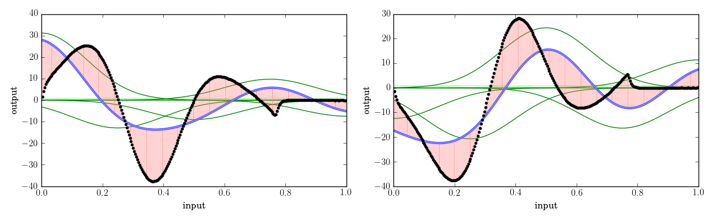
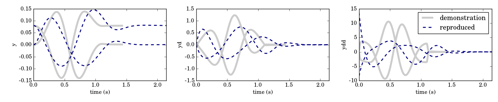
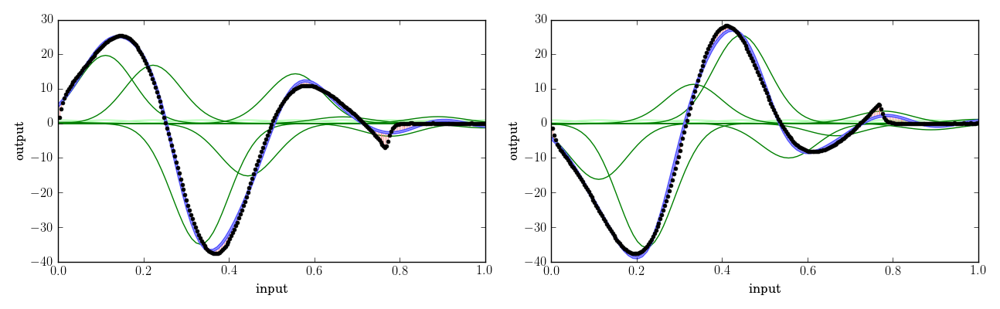
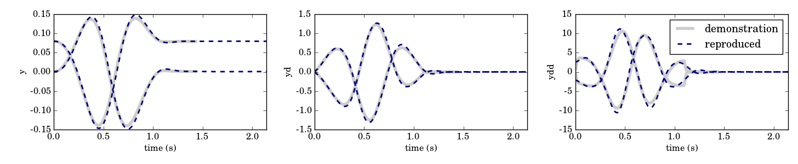
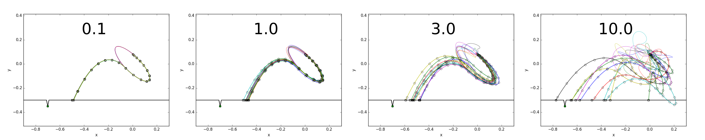

Step-by-step howto for training and optimizing a DMP on a real robot
===============

*It is assumed that you have already read the tutorials on <a href="../tutorial/dmp_bbo.md">Black Box Optimization of Dynamical Movement Primitives</a>.* 

This tutorial will describe the steps involved in training and optimizing a DMP on a real robot. Probably the easiest way to get dmpbbo running for your robot is to copy this directory `cp -uva dmp_bbo_robot my_own_optimization`, and adapt the cpp and py files to your robot and task.

You can run all the steps below automatically by calling the `demo_robot.bash` script in this directory.

In the task considered in this tutorial, the robot has to throw a ball into a certain area, as illustrated below. The "robot" makes an elliptical movement with its end-effector (blue trajectory), releases the ball (black circles) after 0.6 seconds, so that the ball flies through the air (green trajectory) until it hits the ground. The aim is to throw the ball to a particular position (the green marker on the "floor"). There is a margin of error, illustrated by the dent in the floor.

## Step 1: Train the DMP with a demonstration

It is common practice to initialize the DMP with a demonstrated trajectory, so that the optimization does not have to start from scratch. Given that the optimization algorithms are local, such an initialization is essential to avoid local minima that do not solve the task.

This initialization is done with the following command (the binary is compiled from `step1A_trainDmpFromTrajectoryFile.cpp`):

    ./step1A_trainDmpFromTrajectoryFile trajectory.txt results/dmp.xml results/policy_parameters.txt results/train/ 5

This reads a trajectory from a file (for the format see the Trajectory class), trains a DMP, and saves it to an xml file with boost::serialization. The policy parameters of this DMP, which are to be optimized in the subsequent optimization step, are also stored in `policy_parameters.txt`. To analyze the fitting process and tune training meta-parameters, the intermediate fitting results are written to `results/train/`. These can be plotted with:

     python3 step1B_trainDmpFromTrajectoryFilePlot.py results/train/

The "5" in the call to `step1A_trainDmpFromTrajectoryFile` is a meta-parameter, in this example the number of basis functions. The first plot shows the results of the function approximation inside each DMP dimension, where the black dots are the input data, the blue line is the approximation, and the vertical red lines is the difference between them (the "residuals"). The x and y-axis are annotated with the vague "input" and "output". This is because the function approximator inside the DMP has not clue what it is fitting. 

The third plot shows the demonstrated trajectory and the reproduced trajectory (the second plot shows more detailed results of integrating the trained DMP). The demonstrated trajectory is the eliptical movement illustrated in the figure above.

In the results above, the fitting is not very good, i.e. there is a large difference between the input data and the fitted function. We therefore also see that the reproduced trajectory does not fit the demonstrated trajectory well. This is because 5 basis function do not suffice to fit the data accurately. So let's increase the number of basis functions to 10

    ./step1A_trainDmpFromTrajectoryFile trajectory.txt results/dmp.xml results/policy_parameters.txt results/train/ 10
     python3 step1B_trainDmpFromTrajectoryFilePlot.py results/train/

Which yields the following result:

     
This fit is quite good, so let's go with 10 basis functions. Note that with 20 basis functions, the fit is even better. But more basis functions means a higher-dimensional search space for the subsequent optimization, and therefore slower convergence to the (local) optimum. This is the trade-off that needs to be anticipated when choosing the number of basis functions.

## Step 2: Define the task (i.e. cost function) and implement executing rollouts on the robot

Defining the task requires you to make a class that inherits from `dmp_bbo.Task`, and implements the following functions:

* `evaluateRollout(cost_vars,...)`. This is the cost function, which takes the cost-relevant variables (cost_vars) as an input, and returns the cost associated with the rollout. cost_vars thus defines the variables the robot needs to record when performing a rollout, as these variables are required to compute the cost.
* `plotRollout(cost_vars,...)`. This function visualizes one rollout.

An example is Python script is available, which writes the defined task to a directory.

    python3 step2_defineTask.py results/
    
The task converts cost-relevant variables into a cost. The robot, who is responsible for executing the rollouts, should write the cost-relevant variable to a file. Therefore, the used must write an interface to the robot that reads a dmp, executes it, and writes the results to a file containing the cost-relevant variables. In the dmp_bbo_robot examples, this interface is the executable `robotPerformRollout` (compiled from `robotPerformRollout.cpp`). 

    ./robotPerformRollout results/dmp.xml results/cost_vars_demonstrated.txt

The results of performing a rollout can be visualized as follows:
    
    python3 plotRollout.py results/cost_vars_demonstrated.txt results/task.p
    
This uses the `plotRollouts(cost_vars,...)` function in the `Task` to plot the rollout. An example of its output is plotted below.
   

For the cost function of this task, the only relevant variables are the landing position of the ball, and the accelerations at each time step (accelerations are also penalized). In practice however, I usually store more information in cost_vars for visualization purposes, e.g. the end-effector trajectory and the ball trajectory. These are not needed to compute the cost with `evaluateRollout(cost_vars,...)`, but certainly help to provide sensible plots with `plotRollouts(cost_vars,...)`

Gathering the information for cost-vars can be non-trivial in practice. For instance, for the ball-in-cup experiments on the Meka robot, the end-effector position was recorded by the robot, and stored at each time step. The ball trajectory was recorded with an external camera, passed to the robot, which stored it inside the cost_vars matrix alongside the end-effector positions.

## Step 3: Tune the exploration noise for the optimization

During the stochastic optimization, the parameters of the DMP will be sampled from a Gaussian distribution (which parameters these are is set through the `Parameterizable` class from which `Dmp` inherits. See the "`set<string> parameters_to_optimize`" code in `step1A_trainDmpFromTrajectoryFile.cpp` for an example). The mean of this distribution will be the parameters that resulted from training the DMP with a demonstration through supervised learning. 

The covariance matrix of this distributions determines the magnitude of exploration. This magnitude is defined in terms of sigma, where the diagonal of the covariance matrix is initialized with sigma^2. Sigma should not be too low, otherwise the stochasticity of the exploration may be smaller than that of the robot movement itself, and no learning can take place. It should also not be too high for safety reasons; your robot may reach acceleration limits, joint limits, or unexpectedly bump into the environment. 

You can tune this parameter by calling the following three scripts for different exploration magnitudes:

    SIGMA=0.1      # Exploration magnitude to try (start low!)
    N_SAMPLES=10 # Number of samples to generate
    # Generate samples with this magnitude
    # This will save samples to directories 
    #     results/tune_exploration_0.1/rollout001/policy_parameters.txt
    #     results/tune_exploration_0.1/rollout002/policy_parameters.txt
    #     etc
    python3 step3A_tuneExploration.py results/policy_parameters.txt results/distribution_initial_covar.txt results/tune_exploration_${SIGMA}/ ${SIGMA} ${N_SAMPLES}
    # Execute the Dmps with sampled parameters on the robot
    ./step3B_performExplorationRollouts.bash results/dmp.xml results/tune_exploration_${SIGMA}/
    # Plot the rollouts to see the variance in the movements
    python3 step3C_tuneExplorationPlot.py results/tune_exploration_${SIGMA}/ results/task.p

Below the results of exploring with sigma 0.1, 1.0, 3.0, and 10.0. The value 0.1 is probably too low, because there is hardly any variation in the end-effector movement. 10.0 is definitely too high! If you execute this on your robot you are a braver person than I (Quote from the license: "This library is distributed in the hope that it will be useful, but WITHOUT ANY WARRANTY". If your bravery breaks your robot, don't blame me!). Given these results, I'd be comfortable with a value between 1.0 and 3.0. We'll continue with 3.0 in this tutorial, as we can't break any robots in simulation.

If you are performing the optimization with covariance matrix adapation (CMA), i.e. with the UpdaterCovarAdaptation, I would set the initial sigma to 3.0, max_level to 3.0 (so that the exploration is not adapted to more than 3.0) and min_level 0.3 (to avoid premature convergence along one of the dimensions). These parameters are set in `step4A_oneOptimizationUpdate.py`, which we turn to next.

## Step 4: Run the optimization (step by step)

Now we have trained a dmp (stored in `dmp.xml`), specified the task (stored in `task.p`), and tuned the exploration (stored in `distribution_initial_covar.txt`). Now it's time to run the optimization! This is an iterative process with two main steps (and an optional step of plotting intermediate results). Each iteration is called an "update", as it involves one update of the policy parameters.

### Step 4A: Update parameters 

This is a highly automized process, which is called as follows

    python3 step4A_oneOptimizationUpdate.py  results/

This will automatically find the most recent update (e.g. `results/update0083/`) and read all cost_vars in the rollouts in this update directory (which are stored in `update0083/rollout001/cost_vars.txt`, `update0083/rollout002/cost_vars.txt`, etc.). It then computes the costs from each cost_vars (with `task.evaluateRollout(...)`), and updates the policy parameters. Finally, it samples new policy parameters, and saves them in a new update directory (i.e. `update0084/rollout001/policy_parameters.txt`, `update0084/rollout002/policy_parameters.txt`, etc.)

Note: on the first call this script only writes the samples, but does not read the rollouts, as there are none yet.

### Step 4B: Perform rollouts

Performing the rollouts on the robot is done with the same `./robotPerformRollout` executable as above. There is a convenience bash script

    robotPerformRollouts.bash results/dmp.xml results/update00084/

which loops over all `rolloutNNNN/` directories and calls `./robotPerformRollout` on each. Finally, the `step4B_performRollouts.bash` determines the current update (e.g. `update0084/`), calls `robotPerformRollouts.bash` with this directory

    ./step4B_performRollouts.bash results/

Note that all of the scripts/programs in Step 4B will be very specific to your robot. For instance, you may have a Simulink model that implements the policy, and instead of robotPerformRollouts.bash you may have a python script or some ROS-based solution. As long as it sticks to the conventions in the directory structure with updates in `update00084/` directories, rollouts in `rollout001/`, policy parameters read from `policy_parameters.txt` and cost-relevant variables written to `cost_vars.txt` in these directories, all is good.

### Step 4C: Plotting intermediate results

Iteratively executing the two steps above iteratively leads to (you'll probably have this scripted somehow)

    python3 step4A_oneOptimizationUpdate.py results/ 
    ./step4B_performRollouts.bash results/
    python3 step4A_oneOptimizationUpdate.py results/
    ./step4B_performRollouts.bash results/
    python3 step4A_oneOptimizationUpdate.py results/
    ./step4B_performRollouts.bash results/

If you are curious about intermediate results, you can visualize them with

    python3 step4C_plotOptimization.py results/

This will automatically determine what the last update directory is, and plot the optimization process so far, as shown below. The left graph shows the evaluation rollout after each update, the red one being the first, and more green rollouts corresponding to more recent rollouts. The second plot shows 2 dimensions of the search space (in this case 2*10 basis functions is 20D). The third plot shows the exploration magnitude (sigma) at each update. Here it decays, with a decay factor of 0.9, which is specified in `step4A_oneOptimizationUpdate.py`. The final graph shows the learning curve. The black line corresponds to the cost of the evaluation rollout, which is based on the updated mean of the Gaussian distribution. The thinner lines correspond to the different cost components, in this case the distance to the landing site, and the cost for accelerations. Finally, the grey dots correspond to each rollout during the optimization, i.e. those sampled from the Gaussian distribution.

We see that after 15 rollouts, the "robot" has learned to throw the ball in the specified area. The accelerations have increased slightly because the movement to do this requires slightly higher velocities than those in the demonstration.
