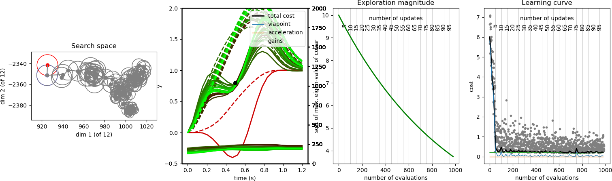
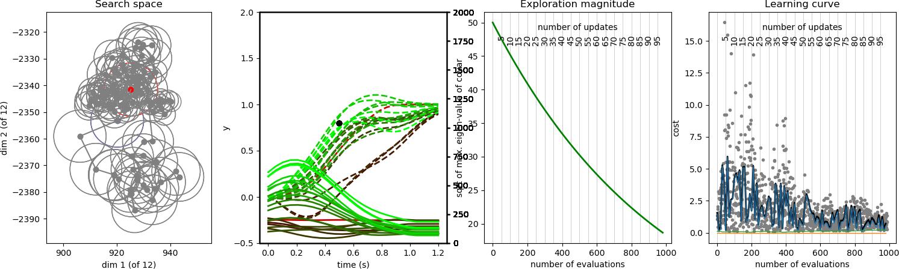

# Optimization of gains in (stochastic) force fields

With DmpWithSchedules, it is possible to learn variable gain schedules, as was first published in the paper "Learning variable impedance control", J Buchli, F Stulp, E Theodorou, S Schaal, in the 
International Journal of Robotics Research, 2011.

This demo implements an experiment similar to the one presented in the paper "Reinforcement learning of impedance control in stochastic force fields", F Stulp, J Buchli, A Ellmer, M Mistry, E Theodorou, S Schaal, IEEE International Conference on Development and Learning, 2011. The explanation in this README will be much easier to follow after having read that paper.

##  Force field illustration

The graphs below illustrate the context. The dashed lines in the right graphs is the reference trajectory. The Gaussian-shaped graphs to the left represent force fields that are applied to these trajectories (i.e. an acceleration added at each time step). There are 5 different force fields, with different strengths (the green one represents no force field, i.e. the added accelerations are 0). 

In the right graphs, the solid line is the trajectory that arises from applying a PD-controller between the reference trajectory and the current trajectory. Here the effect of applying the force field becomes clear. The center graphs represent the (proportional) gain schedules used for the PD-controller for each row. Here the gains are constant over time. With low gains, the tracking of the reference trajectory is bad (right upper graph), with high gains (righ lower graph) tracking is much better.

##  Optimization of gains

Given this context, the aim of the optimizion task (implemented in TaskViapointWithGains) is to pass through a 1D viapoint at t=0.5, and minimize the gains that are used. When executing the DMP that is being optimized (implemented in TaskSolverDmpWithGainsAndForceField), a force field is applied to the DMP. The schedule for the P-gain of the PD controller is encoded in the schedule of the DmpWithSchedules.

### Learning in a constant force field (low gains with 'after effects')

With a constant force field, the results are typically as in the figure below. In the second graph, initially the reference trajectory (red, dashed) goes through the viapoint. But the Gaussian-shaped force field, which pushes downwards, makes the initial actual trajectory (red, solid) go below the viapoint. After 50 updates, the reference trajectory generated by the DMP (brigh green, dashed) lies above the viapoint. When the force field is applied to this reference trajectory, it pushes the actual trajectory to go exactly through the viapoint (bright green solid line). This is possible because the force field is the same at each trial, and can thus be "predicted" by the optimized DMP. If the force field would be turned off suddenly, the actual trajectory would be equivalent to the reference trajectory, and overshoot the viapoint. This is known in biophysics as an "after effect". Note that not much is happening with the gains (plotted at the bottom, see the right axis for the values of the gains). The go up after the first optimization updates (dark red lines), and settle on their initial low value (P=10) soon afterwards during learning.

### Learning in a stochastic force field (high gains when appropriate)

In a stochastic force field, the force field is different during each trial (uniformly sampled from a range). Sometimes it is pushing up, sometimes down. Sometimes it is strong, sometimes it is weak (as in the first graph that illustrated the force fields). This cannot be compensated for by "overshooting" with the reference trajectory, as for the constant force field. Instead, after learning, the reference trajectory (bright green, dashed) goes approximately through the viapoint. The gains however go up substantially before reaching the viapoint (solid lines at the bottom). This is to compensate for the unpredictable perturbations due to the stochastic force field; higher gains lead to better tracking of the reference trajectory. Note that only the (dashed) reference trajecrory is plotted here, not the actual trajectory. The actual trajectory is different every time because the force field is stochastic, and these trajectories only clutter the image. Because there is no reward for good tracking after having passed through the viapoint, the gains go down substantially after the viapoint at t=0.5, back to there minimum (P=10).

