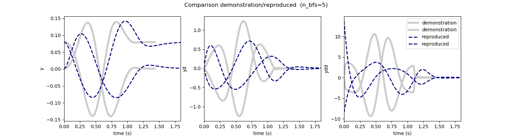
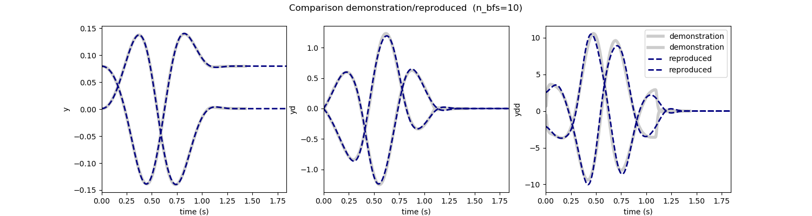
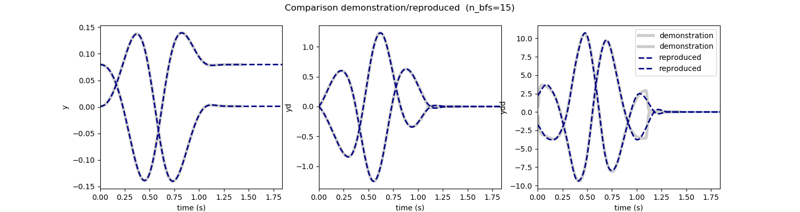
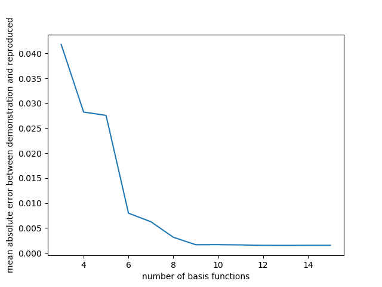
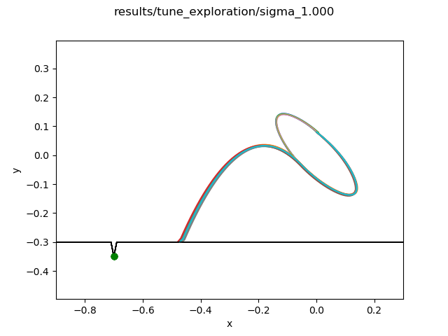
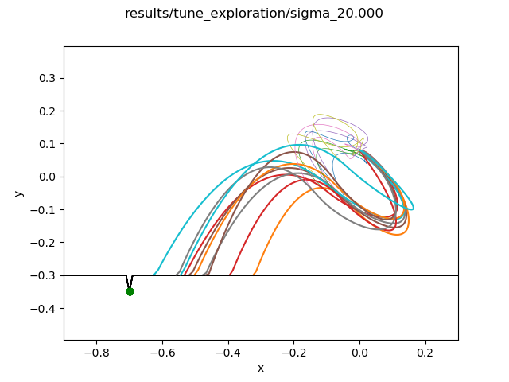
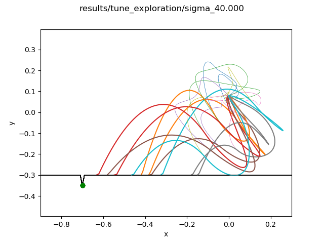
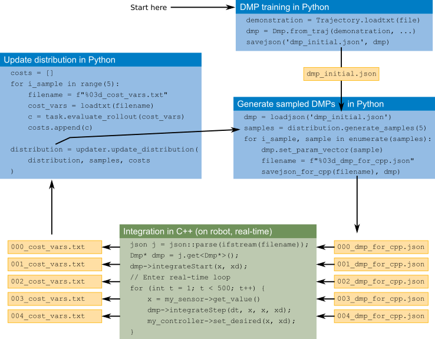
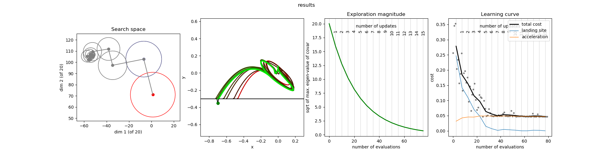

# Step-by-step howto for training and optimizing a DMP on a real robot

*It is assumed that you have already read the tutorial on <a href="../../tutorial/bbo_of_dmps.md">Black Box Optimization of Dynamical Movement Primitives</a>.* 

This tutorial will describe the steps involved in training and optimizing a DMP on a real robot. Probably the easiest way to get dmpbbo running for your robot is to copy this directory `cp -uva demos/robot mycode`, and adapt the cpp and py files to your robot and task.

The steps are:

* Step 1: Train the DMP with a demonstration
* Step 2: Define the task and implement executing DMPs on the robot
* Step 3: Tune the exploration noise for the optimization
* Step 4: Prepare the optimization
* Step 5: Run the optimization update-per-update
    * Step 5A: Executing the DMPs
    * Step 5B: Update the distribution 
    * Plotting intermediate results

You can run all the steps below automatically by calling the <a href="demo_robot.bash">`demo_robot.bash`</a> script in this directory.

## ThrowBall task

In the task considered in this tutorial, the robot has to throw a ball into a certain area, as illustrated below. The "robot" makes an elliptical movement with its end-effector (blue trajectory), releases the ball (black circles) after 0.6 seconds, so that the ball flies through the air (green trajectory) until it hits the ground. The aim is to throw the ball to a particular position (the green marker on the "floor"). There is a margin of error, illustrated by the dent in the floor.


## Step 1: Train the DMP with a demonstration

It is common practice to initialize a DMP with a demonstrated trajectory, so that the optimization does not have to start from scratch. Given that the optimization algorithms are local, such an initialization is essential to avoid local minima that do not solve the task.

Training is done with 
<a href="step1_train_dmp_from_trajectory_file.py">`step1_train_dmp_from_trajectory_file.py`</a> in the following command:

```
python3 step1_train_dmp_from_trajectory_file.py trajectory.txt results/training --n 15 --save
```

This reads a trajectory from a file (for the format see the Trajectory class), and trains DMP with a different number of basis functions (3 to 15). For each number, a different json file with the DMP is stored. To analyze the fitting process and tune training meta-parameters, the results are written to `results/training/`. Below, the result of training with 5, 10 and 15 basis functions are shown:







In the results above, the fitting with 5 basis functions is not very good, i.e. the reproduced trajectory does not fit the demonstrated trajectory well. This is because 5 basis function do not suffice to fit the data accurately. The fit with 10 basis functions is quite good. Note that with 20 basis functions, the fit is even better. But more basis functions means a higher-dimensional search space for the subsequent optimization, and therefore slower convergence to the (local) optimum. This is the trade-off that needs to be anticipated when choosing the number of basis functions.

In the `results/training` directory, there is also an image that plots the mean absolute error between the demonstration and the reproduction against the number of basis functions. Here we see that 10 is indeed a good choice, and a higher number of basis functions does not lead to higher fitting accuracy.



Thus, we set the initial DMP for optimization to be the DMP with 10 basis functions:

```
cp results/training/dmp_trained_10.json results/dmp_initial.json
```


## Step 2: Define the task (i.e. cost function) and implement executing rollouts on the robot

Defining the task requires you to make a class that inherits from <a href="../../dmpbbo/bbo_of_dmps/Task.py">`Task`</a>, and implements the following functions:

* `evaluate_rollout(cost_vars, sample)`. This is the cost function, which takes the cost-relevant variables (`cost_vars`) as an input (and the sample for regularization), and returns the cost associated with the rollout. `cost_vars` thus defines the variables the robot needs to record when performing a rollout, as these variables are required to compute the cost.
* `plot_rollout(cost_vars)`. This function visualizes one rollout.

The task, in this case <a href="TaskThrowBall.py">`TaskThrowBall`</a> is saved to file as JSON with the following script:

```
python3 step2_define_task.py results/
```
    
The task converts cost-relevant variables into a cost. The robot, which is responsible for executing the rollouts, should write the cost-relevant variable to a file. Therefore, the user must write an interface to the robot that reads a dmp, executes it, and writes the results to a file containing the cost-relevant variables. In this demo, this interface is the executable `robotExecuteDmp` (compiled from <a href="robotExecuteDmp.cpp">`robotExecuteDmp.cpp`</a>). Executing and plotting the initial DMP can be done with:

```
# Execute the DMP on your robot, and write cost-vars
../../bin/robotExecuteDmp results/training/dmp_trained_10_for_cpp.json tmp_cost_vars.tx
# Plot the cost-vars (which required knowledge of the task)
python3 plot_rollouts.py tmp_cost_vars.txt results/task.json
```
Note that there are often two JSON versions of the DMP, e.g. `dmp_trained_10.json` and `dmp_trained_10_for_cpp.json`. The former is written with `jsonpickle` (which makes it easier to read into Python with `jsonpickle`) and the latter is a simpler custom JSON format (which is easier to read into C++). See <a href="../../dmpbbo/json_for_cpp.py">`json_for_cpp.py`</a> for details. 

For the cost function of this task, the only relevant variables are the landing position of the ball, and the accelerations at each time step (accelerations are also penalized). In practice however, I usually store more information in cost_vars for visualization purposes, e.g. the end-effector trajectory and the ball trajectory. These are not needed to compute the cost with `evaluate_rollout(cost_vars, sample)`, but certainly help to provide sensible plots with `plot_rollout(cost_vars)`

Gathering the information for cost-vars can be non-trivial in practice. For instance, for the ball-in-cup experiments on the Meka robot, the end-effector position was recorded by the robot, and stored at each time step. The ball trajectory was recorded with an external camera, passed to the robot, which stored it inside the `cost_vars` matrix alongside the end-effector positions. All of these aspect have been simulated in <a href="robotExecuteDmp.cpp">`robotExecuteDmp.cpp`</a>.

## Step 3: Tune the exploration noise for the optimization

During the stochastic optimization, the parameters of the DMP will be sampled from a Gaussian distribution. The mean of this distribution will be the parameters that resulted from training the DMP with a demonstration through supervised learning.

In this demo, we tune the weights of the radial basis function networks in the DMP, which has been set with `dmp.set_selected_param_names("weights")` in `step1_train_dmp_from_trajectory_file.py`. The function `set_selected_param_names` is part of the <a href="../../dmpbbo/functionapproximators/Parameterizable.py">`Parameterizable`</a> class from which <a href="../../dmpbbo/dmps/Dmp.py">`Dmp`</a> inherits.

The covariance matrix of the sampling distributions determines the magnitude of exploration. This magnitude is defined in terms of sigma, where the diagonal of the covariance matrix is initialized with sigma^2. Sigma should not be too low, otherwise the stochasticity of the exploration may be smaller than that of the robot movement itself, and no learning can take place. It should also not be too high for safety reasons; your robot may reach acceleration limits, joint limits, or unexpectedly bump into the environment. 

You can tune this parameter by calling the following:

```
# Generate some samples, based on the initial DMP
python3 step3_tune_exploration.py results/dmp_initial.json results/tune_exploration --save --n 10 --sigma   1.0

# Call robotExecuteDmp for each sample
for i_sample in $(seq -f "%02g" 0 9)
do # Run the sampled DMPs on the robot
  ../../bin/robotExecuteDmp results/tune_exploration/sigma_1.000/${i_sample}_dmp_for_cpp.json results/tune_exploration/sigma_1.000/${i_sample}_cost_vars.txt
done
python3 plot_rollouts.py results/tune_exploration/sigma_1.000 results/task.json --save
```

Below the results of exploring with sigma 1.0, 20.0, and 40.0.








The value 1.0 is probably too low, because there is hardly any variation in the end-effector movement. 40.0 is definitely too high! If you execute this on your robot you are a braver person than I (Quote from the license: "This library is distributed in the hope that it will be useful, but WITHOUT ANY WARRANTY". If your bravery breaks your robot, don't blame me!). Given these results, I'd be comfortable with a value between 1.0 and 20.0. We'll continue with 20.0 in this tutorial, as we can't break any robots in simulation. We copy the selected distribution to be the initial one:

```
cp results/tune_exploration/sigma_20.000/distribution.json results/distribution_initial.json
```

## Step 4: Prepare the optimization

Whereas Step 1 has defined the search space (with `dmp.set_selected_param_names("weights")`), and Step 3 has determined the initial distribution for the optimization, Step 4 defines how the distribution is updated over time. It does so by initializing an <a href="../../dmpbbo/bbo/updaters.py">`Updater`</a>, e.g. `UpdaterCovarDecay` or `UpdaterCovarAdaptation`.

<a href="step4_prepare_optimization.py">`step4_prepare_optimization.py`</a> is mainly concerned with such parameter settings. The hard work is done in the call to `dmpbbo.optimization_step_by_step.prepare_optimization`. It sets up various directories, and does a first batch of samples for the optimization process in Step 5. 

## Step 5: Run the optimization update-per-update

Now we have trained a dmp (stored in `dmp_initial.json`), specified the task (stored in `task.json`), tuned the exploration (stored in `distribution_initial.json`), and speficied the distribution update method (in `updater.json`). Now it's time to run the optimization! This is an iterative process with two main steps (and an optional step of plotting intermediate results). Each iteration is called an "update", as it involves one update of the policy parameters. The overall loop (copied and simplified from `demo_robot.bash` to avoid the bash loop syntax which may not be familiar to everyone) is:

Note that the first batch of samples DMPs (`000_dmp_for_cpp.json`, etc) have already been generated in Step 4.

```
for D in results/update00000, results/update00001, results/update00002, etc.
do
  
  # Run the previously sampled DMPs on the robot
  # Evaluation rollout
  ../../bin/robotExecuteDmp ${D}/eval_dmp_for_cpp.json ${D}/eval_cost_vars.txt
  # Samples rollouts
  ../../bin/robotExecuteDmp ${D}/000_dmp_for_cpp.json ${D}/001_cost_vars.txt
  ../../bin/robotExecuteDmp ${D}/001_dmp_for_cpp.json ${D}/002_cost_vars.txt
  ../../bin/robotExecuteDmp ${D}/002_dmp_for_cpp.json ${D}/003_cost_vars.txt
  etc.
  
  # Update the distribution (given the cost_vars above), and generate the
  # next batch of samples
  python3 step5_one_optimization_update.py ${D} 
  
done
```
### Step 5A: Executing the DMPs

In this loop, each call of `../../bin/robotExecuteDmp` is what in real experiments would be the execution of one DMP on the real robot. `robotExecuteDmp` will then likely not be compiled C++ executable, but some (Python?) script, ROS-based solution, etc. As long as it sticks to the conventions in the directory structure with updates in the `update00084/` directories and DMPs and costvars in the appropriate files, `dmpbbo` is applicable.

### Step 5B: Update the distribution 


In the above, <a href="step5_one_optimization_update.py">`step5_one_optimization_update.py`</a> is essentially a wrapper around the function `dmpbbo.optimization_step_by_step.update_step`. It reads the `cost_vars` data from file in the update directory (which are stored in `update00003/000_cost_vars.txt`, `update00003/001_cost_vars.txt`, etc.). It then computes the costs from each cost_vars (with `task.evaluate_rollout(cost_vars)`), and updates the policy parameters based on these costs. Finally, it samples new policy parameters, and saves them in a new update directory (i.e. `update00004/000_dmp_for_cpp.txt`, `update00004/001_dmp_for_cpp.txt`, etc.)

Step 5 is illustrated in the figure below:




### Plotting intermediate results

Plotting (intermediate) results of the optimization can be done with:

```
python3 plot_optimization.py ${D} --save
```

The `--save` flag additional saves the graph to a png file. This script automatically determine what the last update directory is, and plot the optimization process so far, as shown below. 



These plots show:
1. two dimensions of the search space (in this case 2*10 basis functions is 20D)
2. the evaluation rollout after each update, the red one being the first, and more green rollouts corresponding to more recent rollouts. 
3. the exploration magnitude (sigma) at each update. Here it decays, with a decay factor of 0.8, which was specified in <a href="step4_prepare_optimization.py">`step4_prepare_optimization.py`</a>. 
4. the learning curve. The black line corresponds to the cost of the evaluation rollout, which is based on the updated mean of the Gaussian distribution. The thinner lines correspond to the different cost components, in this case the distance to the landing site, and the cost for accelerations. Finally, the grey dots correspond to the cost of each rollout during the optimization, i.e. those sampled from the Gaussian distribution.

We see that after 15 rollouts, the "robot" has learned to throw the ball in the specified area. The accelerations have increased slightly because the movement to do this requires slightly higher velocities than those in the demonstration.

## Executing trajectories (open-loop) instead of DMPs (closed-loop)

In the demo above, the DMP was executed "on the robot" in the `robotExecuteDmp.cpp`. In principle, it is also possible to integrate the DMP off-line before task execution and save it to a trajectory, and then to execute the trajectory on the robot open-loop. The advantage of this is that you may already have functionality to execute pre-determined trajectories on your robot. Applying `dmpbbo` by executing trajectories open-loop would then be more straight-forward than integration the C++ code for real-time DMP integration on your robot.

This approach been implemented in <a href="demo_robot_with_trajectories.bash">`demo_robot_with_trajectories.bash`</a>. It's almost identical to <a href="demo_robot.bash">`demo_robot.bash`</a>, except that  
<a href="robotExecuteDmp.cpp">`robotExecuteDmp`</a> has been replaced with 
<a href="robotExecuteTrajectory.cpp">`robotExecuteTrajectory`</a>, and some of the Python scripts are passed the `--traj` flag. The latter makes the scripts integrate the DMP, and save the resulting trajectory alongside the saved DMP. This trajectory is then read by `robotExecuteTrajectory`.

Note that one of the main advantages of DMPs is their ability to react to perturbations or changes of the goal. This is because they are dynamical systems. If you compute a trajectory off-line and execute the trajectory open-loop, all these advantages are lost! You might as well use splines to pre-compute a trajectory and integrate that. On the other hand, you may argue that the aim of your experiment is to optimize a DMP, and that the on-line adaptation to perturbations is only necessary after the optimization. In any case, `dmpbbo` allows you to do both.
