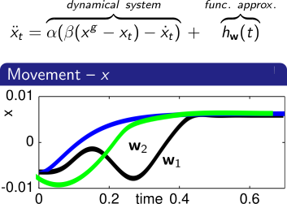

# General overview

DmpBbbo [@stulp2013learning] provides an implementation of dynamical movement primitives (Dmp) [@schaal2006dmp] with a different variety of dynamical systems and function approximators. Moreover, it provides tools to perform black-box optimization (Bbo) [@stulp2014simultaneous] of the parameters of dynamical movement primitives.

A dynamical motion primitive is composed by two main parts:

+ The dynamical system, which provides a simple movement from a start point to end (x^g) in a closed loop fashion:

+ The function approximator, which captures any arbitrary movement from the start point to x^g thanks to the skill parameters w:

### Dynamical movement primitives (Dmp)

By combining both dynamical systems and function approximators it is possible to obtain a generic motion with the following advantages:

+ Stability and robstuness against external perturbations thanks to the closed loop formulation of the dynamical system.

+ Motion primitive generalization to new start and end points.

+ Motion primitive's parameters w can be optimized through black box optimization.

+ The formulation can be easily adapted to Cartesian or Joints space.

+ Given the strong modularity of the motion primitives formulation, it is possible to use indipendently dynamical systems from function approximators or to combine them to have different kind of motion primitives.

### Black box optimization (Bbo)

This module implements several evolution strategies for the optimization of black-box cost functions which can be applied as well to the movement primitive's parameters. 
Black-box in this context means that no assumptions about the cost function can be made, for example, we do not have access to its derivative, and we do not even know if it is continuous or not. The evolution strategies that are implemented are all based on reward-weighted averaging (aka probablity-weighted averaging).

# Purpose of this project

+ To provide a versatile and customizable c++ library that defines a generic interface for dynamical systems and function approximators, as well as several specific implementations of both. Such modularity allows an easy and flexible exchange of different dynamical systems and function approximators within dynamical movement primitives.

+ Being able to compare different exploration strategies (e.g. covariance matrix adaptation vs. exploration decay) when optimizing dynamical movement primitives.

+ Enabling the optimization of different parameter subsets of function approximators.

+ To provide tests and demos to easily grap the concept of dynamical movement primitives and black box optimization.

+ Running dynamical movement primitives on real robots:

Robot names and credits in order of appearance: Icub (Photo by ISIR), MEKA (Photo by ENSTA ParisTech), Pepper (Photo by SoftBank)

# References