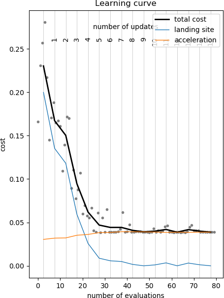

# Black-Box Optimization of Dynamical Movement Primitives (bbo_of_dmps)

*It is assumed that you have already read the tutorials on <a href="bbo.md">Black Box Optimization</a> and <a href="dmp.md">Dynamical Movement Primitives</a>.* 

When applying black-box optimization (BBO) to policy improvement (e.g. optimizing a DMP on a robot), the concept of a "rollout" becomes important. A rollout is the result of executing a policy (e.g. a DMP) with a certain set of policy parameters (e.g. the parameter of the DMP). Although the search space for optimization is in the space of the policy parameters, the costs are rather determined from the rollout.

From an implementation point of view, applying BBO to policy improvement (which may execute DMPs) requires several extensions:

* Using rollouts with a Task/TaskSolver instead of a CostFunction
* Running multiple optimizations in parallel, one for each DOF of the DMP


<a name="sec_bbo_task_and_task_solver"></a>
## CostFunction and Task/TaskSolver

When the cost function has a simple structure, e.g. cost =   it is convenient to implement the function   in a cost function, as in the `CostFunction.evaluate(sample)` function in dmpbbo. The optimization loop then becomes (adapted from `bbo.run_optimization`).


```Python
def run_optimization(...):
    distribution = initial_distribution
    for i_update in range(n_updates):
        # 1. Sample from distribution
        samples = distribution.generate_samples(n_samples_per_update) 
        costs = [cost_function.evaluate(sample) for sample in samples]
        # 2. Evaluate the samples
        distribution = updater.update_distribution(distribution, samples, costs)
        # 3. Update distribution
```

In robotics, I've found it useful to make the distinction between a task (e.g. lift an object), and an entity that solves this task (e.g. your robot, my robot, a simulated robot, etc.). For these cases, the CostFunction is split into a Task and a TaskSolver, as follows:

```Python
class CostFunction:
    def evaluate(sample):
        cost_vars = TaskSolver.perform_rollout(sample)
        cost = Task.evaluate_rollout(cost_vars)
        return cost
```

The roles of the Task/TaskSolver are:

* `TaskSolver.perform_rollout(sample)`: perform a rollout (e.g. exectute a DMP) on the robot (based on a sample in DMP parameter space), and return a matrix of variables related to computing the costs. For instance, the end-effector trajectory of the robot and/or the path of a ball (recorded with a camera) when learning ball-in-cup.
* `Task.evaluate_rollout(cost_vars)`: determine the costs from the cost-relevant variables. E.g. the average accelerations over time, or whether the ball landed in the cup or not.

`cost_vars` should thus contain all variables that are relevant to computing the cost. This depends entirely on the task at hand. Whatever `cost_vars` contains, it should be made sure that a `Task` and its `TaskSolver` are compatible, i.e. the output of `TaskSolver` is the direct input to `Task`. In dmpbbo, this matrix is of size n_time_steps X n_cost_vars, i.e. a vector of cost_vars for each time step. An example is given in `TaskViapoint`, which implements a `Task` in which the first N columns in cost_vars should represent a N-D trajectory. This convention is respected by `TaskSolverDmp`, which is able to generate such trajectories with a DMP.

With this approach, the optimization loop above becomes (simplified from `bbo_of_dmps/run_optimization_task.py`):

```Python
def run_optimization_task(...):
    distribution = initial_distribution
    for i_update in range(n_updates):
        samples = distribution.generate_samples(n_samples_per_update) # 1. Sample from distribution    
        # 2. Evaluate the samples
        costs = []
        for sample in samples:                                  
            # 2A. Perform the rollout
            cost_vars = task_solver.perform_rollout(sample)
            # 2B. Evaluate the rollout            
            cur_cost = task.evaluate_rollout(cost_vars, sample) 
            costs.append(cur_cost)
        # 3. Update the distribution
        distribution = updater.update_distribution(distribution, samples, costs) 
```

At first, this change to appear cosmetic only. However, the concrete advantages of this approach are:

* Different robots can use the same Task implementation of the same task.
* Robots do not need to know about the cost function to perform rollouts (and they shouldn't)
* The intermediate cost-relevant variables can be stored to file for post-experiment visualization, i.e. with `Task.plot_rollout(cost_vars)`, which can be overridden for task-specific plots.
* The procedures for performing the roll-outs (on-line on a robot) and doing the evaluation/updating/sampling (off-line on a computer) can be seperated, because there is a separate `TaskSolver.perform_rollouts()` function, as explained in the next section

<a name="impl"></a>
## Inversion of Control

The works very nicely when `perform_rollout()` is done in simulation, i.e. `perform_rollout()` would have to communicate with a simulator running in the background, telling it to start the execution of some trajectory or DMP. A simulator is one thing; but as a roboticist, I am not comfortable with giving a python optimization loop control over the starting and stopping of real-time control loops on a real robot. Instead, the approach in dmpbbo is to save dmp.json files to disk, and have the robot execute them. The loop thus becomes (introducing the dmp along the way).

```Python
dmp = initial_dmp
distribution = initial_distribution
for i_update in range(n_updates):
    samples = distribution.generate_samples(n_samples_per_update)
    costs = []
    for sample in samples:
        dmp.set_param_vector(sample)  # Set the parameters of the DMP
        save("dmp.json",dmp) # Save the file to disk
        
        # The robot now reads "dmp.json", and executes the dmp.
        # The result of this rollout is saved to "cost_vars.txt".
        
        cost_vars = load("cost_vars.txt")
        cur_cost = task.evaluate_rollout(cost_vars, sample)
        costs.append(cur_cost)
```

This nicely separates the non-real time optimization scripts from the real-time DMP execution on the real robot. But of course, those comments about the robot executing the dmp don't do anything. To integrate the execution of the dmps on the robot, we have to reorganize the loop somewhat.

```Python
# INITIALIZE OPTIMIZATION
# Function names run_optimization... can be found in "optimization_step_by_step.py"
# prepare_optimization(...)
save(task,"task.json")
save(distribution_initial,"distribution_initial.json")
save(dmp_initial,"dmp_initial.json")

# _generate_samples(...)
samples = distribution.generate_samples(n_samples)
save(samples,"samples.txt")
dmp = dmp_initial
for i_sample, sample in enumerate(samples):
    dmp.set_param_vector(sample)
    save("{i_sample:03d}_dmp.json")
```

Now the robot has, one after the other, to load "000_dmp.json", "001_dmp.json" etc, the execute the DMP, and write the relevant cost variables to "000_cost_vars.json", "001_cost_vars.json". With these cost_vars, the sampling distribution for evolutionary optimization is updated, and the next batch of samples is generated 

```Python
# DO ONE DISTRIBUTION UPDATE

# update_step
samples = load("samples.txt")
costs = []
for i_sample, sample in enumerate(samples):
    cost_vars = load("{i_sample:03d}_cost_vars.json")
    cost = task.evaluate_rollout(cost_vars, sample)
    costs.append(cost)

# The cost for each sample is now known. Update the distribution.
distribution = updater.update_distribution(distribution, samples, costs)

# Generate new samples and dmps for execution on the robot.
# _generate_samples(...)
samples = distribution.generate_samples(n_samples)
save(samples,"samples.txt")
dmp = dmp_initial
for i_sample, sample in enumerate(samples):
    dmp.set_param_vector(sample)
    save("{i_sample:03d}_dmp.json")
```

Again the robot reads "000_dmp.json", "001_dmp.json" etc, executes them, and writes to "000_cost_vars.json", "001_cost_vars.json", and the "DO ONE DISTRIBUTION UPDATE" step is performed iteratively.

The LearningSession (in bbo) and LearningSessionTask (in bbo_of_dmps) provide a database interface for the save and load functions in the code above. It is responsible for file management and correct file names, e.g. "results/update00004/001_dmp.json" etc.  

This approach, illustrated below, has been implemented in optimization_step_by_step.py. The demos/robot demo shows the entire approach, including the reading/writing in Python and C++.


### Why ASCII files?!

So all the above could probably be done with bindings or sockets or serialization to binary files or protobufs, etc. This would probably be faster, and perhaps lead to a higher degree of automation (the process in dmpbbo can still be fully automated by combining the steps in a Python or shell script, see for instance `demos/robot/demo_robot.bash`.). However, I've learned to appreciate the "robustness" of ASCII. Over time I've worked in 10 different labs, and they all used different middlewares, programming languages, operating systems and file formats, etc. But they all knew what ASCII and JSON were ;-)  Using ASCII files has allowed this code to quickly be ported to other robots, also by others (e.g. https://www.youtube.com/watch?v=jkaRO8J_1XI). Finally, inspecting a json file allows for basic sanity checks. json is to binary files what XAI is to deep learning ;-)

It's important to realize that dmpbbo is tailored for use on real robots. It's not made for running thousands of rollouts on a CPU cluster, where writing/reading json to file would obviously be a major performance bottleneck. dmpbbo is for running tens or perhaps hundreds of rollouts on a real robot. And the rollout files will not be that large. So in that scenario, the overhead of using json/txt files in terms of execution time or storage space is neglible; the bottleneck will be the robot, which performs in real-time at 1 second per second!

<a name="sec_cost_components"></a>
## Cost components

`Task.evaluate_rollout(cost_vars)` returns a vector of costs. The first element is the total scalar cost (also known as "return" in RL). This is the only value used for optimization. For debugging purposes, I've found it very useful to plot the individual cost components in the learning curve. For instance, consider TaskThrowBall in `demos/robot`. In this case, the cost components are: 1) distance to the landing site and 2) mean of squared accelerations over time. Then 

* cost[0] = sum(cost[1:])
* cost[1] = landing site 
* cost[2] = acceleration

Below is an example learning curve with a visualization of the separate cost components:



<a name="sec_parallel_optimization"></a>
## Optimizing DMP DOFs in parallel

Consider a 7-DOF robotic arm. With a DMP, each DOF would be represented by a different dimension of a 7-D DMP (let as assume that each dimension of the DMP uses 10 basis functions). There are then two distinct approaches towards optimizing the parameters of the DMP with respect to a cost function:

* the search space for optimization is 70-D, i.e. all open parameters of the DMP are in one search space. The disadvantage is that reward-weighted averaging will require more samples to perform a robust update, especially for the covariance matrix, which is 70X70!
* Run a seperate optimization for each of the 7 DOFs. Thus, here we have seven 10-D search spaces (with different distributions and samples for each DOF), but using the same costs for all optimizations. This is what is proposed for instance in PI^2. This approach is not able to exploit covariance between different DOFs, but in practice it works robustly. 

TODO: Show how to set this in the code.
