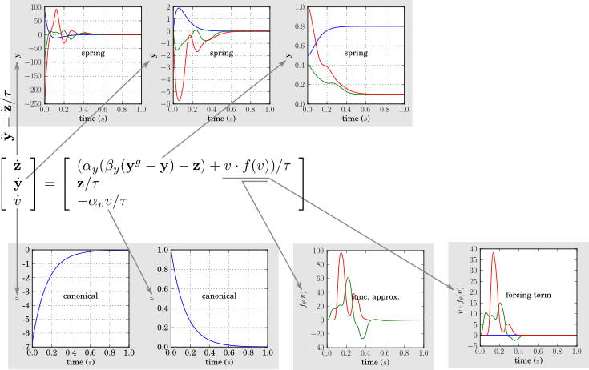
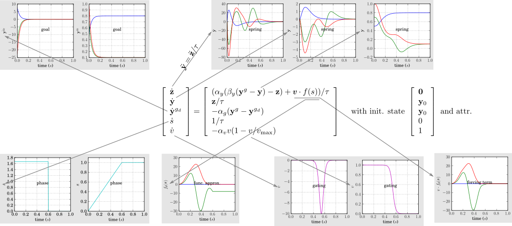

Dynamical Movement Primitives
===============

*It is assumed that you have already read the tutorials on <a href="dynamicalsystems.md">Dynamical Systems</a> and <a href="functionapproximators.md">Function Approximation</a>.*

The core idea behind dynamical movement primitives (DMPs) is to represent movement primitives as a combination of dynamical systems. The state variables of the main dynamical system   then represent trajectories for controlling, for instance, the 7 joints of a robot arm, or its 3D end-effector position. The attractor state is the end-point or *goal* of the movement.

The key advantage of DMPs is that they inherit the nice properties from linear dynamical systems (guaranteed convergence towards the attractor, robustness to perturbations, independence of time, etc) whilst allowing arbitrary (smooth) motions to be represented by adding a non-linear forcing term. This forcing term is often learned from demonstration, and subsequently improved through reinforcement learning.

DMPs were introduced in [[ijspeert02movement]](#ijspeert02movement), but in this section we follow largely the notation and description in [[ijspeert13dynamical]](#ijspeert13dynamical), but at a slower pace.

*Historical remark*. The term "dynamicAL movement primitives" is now preferred over "dynamic movement primitives". The newer term makes the relation to dynamicAL systems more clear, and avoids confusion about whether the output of "dynamical movement primitives" is in kinematic or dynamic space (it is usually in kinematic space).

*Remark*. This documentation and code focusses only on discrete movement primitives. For rythmic movement primitives, we refer to [[ijspeert13dynamical]](#ijspeert13dynamical).

Basic Point-to-Point Movements: A Critically Damped Spring-Damper System
---------------

At the heart of the DMP lies a spring-damper system, as described in <a href="dynamicalsystems.md#dyn_sys_spring_damper">Spring-Damper Systems</a>. In DMP papers, the notation of the spring-damper system is usually a bit different: 

\\ \tau\ddot{y} =&amp; \alpha(-\beta y - \dot{y}) &amp; \mbox{with } \alpha=c,~~\beta = \frac{k}{c},~~m=\tau\\ \tau\ddot{y} =&amp; \alpha(-\beta (y-y^g) - \dot{y})&amp; \mbox{with attractor } y^g\\ \tau\ddot{y} =&amp; \alpha(\beta (y^g-y) - \dot{y})&amp; \mbox{typical DMP notation for spring-damper system}\\ \end{eqnarray*}") 

In the last two steps, we change the attractor state from 0 to  , where   is the goal of the movement.

To avoid overshooting or slow convergence towards  , we prefer to have a <em>critically</em> <em>damped</em> spring-damper system for the DMP. For such systems   must hold, see <a href="dynamicalsystems.md#dyn_sys_critical_damping">Critical Damping</a>. In our notation this becomes  , which leads to  . This determines the value of   for a given value of   in DMPs. The influence of   is illustrated in the first figure <a href="dynamicalsystems.md">here</a>.

Rewriting the second order dynamical system as a first order system (see <a href="dynamicalsystems.md#dyn_sys_rewrite_second_first">Rewriting one 2nd Order Systems as two 1st Order Systems</a>) with expanded state   yields:

-{z}))/\tau \\ {z}/\tau \end{array} \right] \mbox{~~~~with init. state~} \left[ \begin{array}{l} 0 \\ y_0 \end{array} \right] \mbox{~and attr. state~} \left[ \begin{array}{l} {0} \\ {y}^g \end{array} \right] \end{eqnarray*}") 

Please note that in the implementation, the state is implemented as  . The order is inconsequential, but we use the notation above (  ) throughout the rest of this tutorial section, for consistency with the DMP literature.

Arbitrary Smooth Movements: the Forcing Term
---------------

The representation described in the previous section has some nice properties in terms of <a href="dynamicalsystems.md#sec_dyn_sys_convergence">convergence towards the attractor</a> , <a href="dynamicalsystems.md#sec_dyn_sys_perturbations">robustness to perturbations</a> , and <a href="dynamicalsystems.md#sec_dyn_sys_autonomy">autonomy</a>, but it can only represent very simple movements. To achieve more complex movements, we add a time-dependent forcing term to the spring-damper system. The spring-damper systems and forcing term are together known as a <em>transformation</em> <em>system</em>.

-{z}) + f(t))/\tau \\ {z}/\tau \end{array} \right] \mbox{~~~~with init. state~} \left[ \begin{array}{l} 0 \\ y_0 \end{array} \right] \mbox{~and attr. state~} \left[ \begin{array}{l} {?} \\ {y}^g \end{array} \right] \end{eqnarray*}") 

The forcing term is an open loop controller, i.e. it depends only on time. By modifying the acceleration profile of the movement with a forcing term, arbitrary smooth movements can be achieved. The function $")  is usually a function approximator, such as locally weighted regression (LWR) or locally weighted projection regression (LWPR), see <a href="functionapproximators.md">Function Approximation</a>. The graph below shows an example of a forcing term implemented with LWR with random weights for the basis functions.

.")

Ensuring Convergence to 0 of the Forcing Term: the Gating System
---------------

Since we add a forcing term to the dynamical system, we can no longer guarantee that the part of the system repesenting   will converge towards  ; perhaps the forcing term continually pushes it away   (perhaps it doesn't, but the point is that we cannot <em>guarantee</em> that it <em>always</em> doesn't). That is why there is a question mark in the attractor state in the equation above.

To guarantee that the movement will always converge towards the attractor  , we need to ensure that the forcing term decreases to 0 towards the end of the movement. To do so, a gating term is added, which is 1 at the beginning of the movement, and 0 at the end. This gating term itself is determined by, of course, a dynamical system. In [[ijspeert02movement]](#ijspeert02movement), it was suggested to use an exponential system. We add this extra system to our dynamical system by expanding the state as follows:

-{z}) + v\cdot f(t))/\tau \\ {z}/\tau \\ -\alpha_v v/\tau \end{array} \right] \mbox{~~~~with init. state~} \left[ \begin{array}{l} 0 \\ y_0 \\ 1 \end{array} \right] \mbox{~and attr. state~} \left[ \begin{array}{l} {0} \\ {y}^g \\ 0 \end{array} \right] \end{eqnarray*}") 

Ensuring Autonomy of the Forcing Term: the Phase System
---------------

By introducing the dependence of the forcing term $")  on time   the overall system is no longer autonomous. To achieve independence of time, we therefore let   be a function of the state of an (autonomous) dynamical system rather than of  . This system represents the <em>phase</em> of the movement. [[ijspeert02movement]](#ijspeert02movement) suggested to use the same dynamical system for the gating and phase, and use the term <em>canonical</em> <em>system</em> to refer this joint gating/phase system. Thus the phase of the movement starts at 1, and converges to 0 towards the end of the movement, just like the gating system. The new formulation now is (the only difference is $")  instead of $") ):

-{z}) + v\cdot f(v))/\tau \\ {z}/\tau \\ -\alpha_v v/\tau \end{array} \right] \mbox{~~~~with init. state~} \left[ \begin{array}{l} 0 \\ y_0 \\ 1 \end{array} \right] \mbox{~and attr. state~} \left[ \begin{array}{l} {0} \\ {y}^g \\ 0 \end{array} \right] \end{eqnarray*}") 

Note that in most papers, the symbol for the state of the canonical system is  . Since this symbol is already reserved for the state of the complete DMP, we rather use  

*Todo*: Discuss goal-dependent scaling, i.e. v(y^g-y_0) $")

Multi-dimensional Dynamic Movement Primitives
---------------

Since DMPs usually have multi-dimensional states (e.g. one output   for each of the   joints), it is more accurate to use bold fonts for the state variables (except the gating/phase system, because it is always 1D) so that they represent vectors:

-\mathbf{z}) + v\cdot \mathbf{f}(v))/\tau \\ \mathbf{z}/\tau \\ -\alpha_v v/\tau \end{array} \right] \mbox{~~~~with init. state~} \left[ \begin{array}{l} \mathbf{0} \\ \mathbf{y}_0 \\ 1 \end{array} \right] \mbox{~and attr. state~} \left[ \begin{array}{l} \mathbf{0} \\ \mathbf{y}^g \\ 0 \end{array} \right] \end{eqnarray*}") 

So far, the graphs have shown 1-dimensional systems. To generate D-dimensional trajectories for, for instance, the 7 joints of an arm or the 3D position of its end-effector, we simply use D transformation systems. A key principle in DMPs is to use one and the same phase system for all of the transformation systems, to ensure that the output of the transformation systems are synchronized in time. The image below show the evolution of all the dynamical systems involved in integrating a multi-dimensional DMP.

Alternative Systems for Gating, Phase and Goals
---------------

The DMP formulation presented so far follows [[ijspeert02movement]](#ijspeert02movement). Since then, several variations have been proposed, which have several advantages in practice. We now describe some of these variations.

### Gating: Sigmoid System

A disadvantage of using an exponential system as a gating term is that the gating decreases very quickly in the beginning. Thus, the output of the function approximator  $")  needs to be very high towards the end of the movement if it is to have any effect at all. This leads to scaling issues when training the function approximator.

Therefore, sigmoid systems have more recently been proposed [[kulvicius12joining]](#kulvicius12joining) as a gating system. This leads to the following DMP formulation (since the gating and phase system are no longer shared, we introduce a new state variable   for the phase term):

-\mathbf{z}) + v\cdot f(s))/\tau \\ \mathbf{z}/\tau \\ -\alpha_s s/\tau \\ -\alpha_v v (1-v/v_{\mbox{\scriptsize max}}) \end{array} \right] \mbox{~~~~with init. state~} \left[ \begin{array}{l} \mathbf{0} \\ \mathbf{y}_0 \\ 1 \\ 1 \end{array} \right] \mbox{~and attr. state~} \left[ \begin{array}{l} \mathbf{0} \\ \mathbf{y}^g \\ 0 \\ 0 \end{array} \right] \end{eqnarray*}") 

where the term   is determined by  

### Phase: Constant Velocity System

In practice, using an exponential phase system may complicate imitation learning of the function approximator  , because samples are not equidistantly spaced in time. Therefore, we introduce a dynamical system that mimics the properties of the phase system described in [[kulvicius12joining]](#kulvicius12joining), whilst allowing for a more natural integration in the DMP formulation, and thus our code base. This system starts at 0, and has a constant velocity of  , which means the system reaches 1 when  . When this point is reached, the velocity is set to 0.

 

This is admittedly not very elegant, as this discontinuous dynamical system leads to a non-smooth velocity and acceleration profiles. However, the velocities and accelerations of this system are never used, as only the phase itself is passed to the function approximators. So it's not elegant, but it doesn't hurt. This system has been implemented in the TimeSystem class.

With the constant velocity dynamical system the DMP formulation becomes:

-\mathbf{z}) + v\cdot f(s))/\tau \\ \mathbf{z}/\tau \\ 1/\tau \\ -\alpha_v v (1-v/v_{\mbox{\scriptsize max}}) \end{array} \right] \mbox{~~~~with init. state~} \left[ \begin{array}{l} \mathbf{0} \\ \mathbf{y}_0 \\ 0 \\ 1 \end{array} \right] \mbox{~and attr. state~} \left[ \begin{array}{l} \mathbf{0} \\ \mathbf{y}^g \\ 1 \\ 0 \end{array} \right] \end{eqnarray*}") 

### Zero Initial Accelerations: the Delayed Goal System

Since the spring-damper system leads to high initial accelerations (see the graph to the right below), which is usually not desirable for robots, it was suggested to move the attractor of the system from the initial state   to the goal state   <em>during</em> the movement [[kulvicius12joining]](#kulvicius12joining). This delayed goal attractor   itself is represented as an exponential dynamical system that starts at  , and converges to   (in early versions of DMPs, there was no delayed goal system, and   was simply equal to   throughout the movement). The combination of these two systems, listed below, leads to a movement that starts and ends with 0 velocities and accelerations, and approximately has a bell-shaped velocity profile. This representation is thus well suited to generating human-like point-to-point movements, which have similar properties.

-\mathbf{z}) + v\cdot f(s))/\tau \\ \mathbf{z}/\tau \\ -\alpha_g({\mathbf{y}^g-\mathbf{y}^{g_d}}) \\ 1/\tau \\ -\alpha_v v (1-v/v_{\mbox{\scriptsize max}}) \end{array} \right] \mbox{~~~~with init. state~} \left[ \begin{array}{l} \mathbf{0} \\ \mathbf{y}_0 \\ \mathbf{y}_0 \\ 0 \\ 1 \end{array} \right] \mbox{~and attr. state~} \left[ \begin{array}{l} \mathbf{0} \\ \mathbf{y}^g \\ \mathbf{y}^g \\ 1 \\ 0 \end{array} \right] \end{eqnarray*}") 

In my experience, this DMP formulation is the best for learning human-like point-to-point movements (bell-shaped velocity profile, approximately zero velocities and accelerations at beginning and start of the movement), and generates nice normalized data for the function approximator without scaling issues. The image below shows the interactions between the spring-damper system, delayed goal system, phase system and gating system.

Summary
---------------

The core idea in dynamical movement primitives is to combine dynamical systems, which have nice properties in terms of convergence towards the goal, robustness to perturbations, and independence of time, with function approximators, which allow for the generation of arbitrary (smooth) trajectories. The key enabler to this approach is to gate the output of the function approximator with a gating system, which is 1 at the beginning of the movement, and 0 towards the end.

Further enhancements can be made by making the system autonomous (by using the output of a phase system rather than time as an input to the function approximator), or having initial velocities and accelerations of 0 (by using a delayed goal system).

Multi-dimensional DMPs are achieved by using multi-dimensional dynamical systems, and learning one function approximator for each dimension. Synchronization of the different dimensions is ensure by coupling them with only <em>one</em> phase system. 

Further reading: Bibliography
---------------

* <b>[ijspeert02movement]</b>  A. J. Ijspeert, J. Nakanishi, and S. Schaal. Movement imitation with nonlinear dynamical systems in humanoid robots. In <em>Proceedings of the IEEE International Conference on Robotics and Automation (ICRA)</em>, 2002.
* <b>[ijspeert13dynamical]</b>  A. Ijspeert, J. Nakanishi, P Pastor, H. Hoffmann, and S. Schaal. Dynamical Movement Primitives: Learning attractor models for motor behaviors. <em>Neural Computation</em>, 25(2):328-373, 2013.
* <b>[kulvicius12joining]</b>  Tomas Kulvicius, KeJun Ning, Minija Tamosiunaite, and Florentin Wörgötter. Joining movement sequences: Modified dynamic movement primitives for robotics applications exemplified on handwriting. <em>IEEE Transactions on Robotics</em>, 28(1):145-157, 2012.

Further reading: dmpbbo tutorials
---------------

The next tutorials to go to would be:
* <a href="bbo_of_dmps.md">Black-Box Optimizaton for Dynamical Movement Primitives</a> (if you already know about black-box optimization)
* <a href="bbo.md">Black-Box Optimizaton</a> (if you don't)

